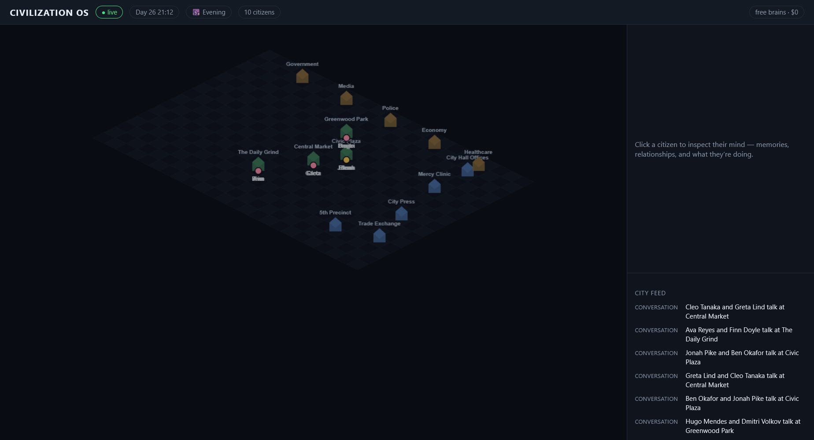
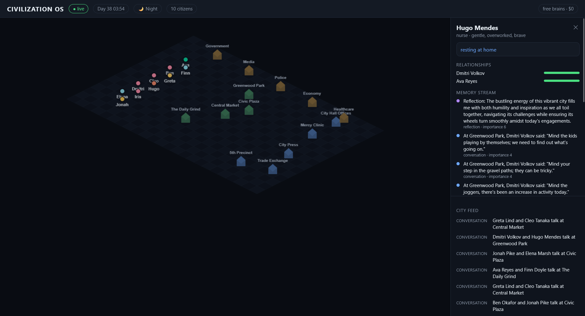

# CivilizationOS

> A living AI society you can perturb. Autonomous citizen-agents inhabit an
> animated isometric city while five institutional **councils of specialists**
> debate and govern. Inject a pandemic, drought, cyberattack, election, or crime —
> then watch society react in real time.

A hybrid of two paradigms: **AGORA** (generative-agent society) × **PANTHEON**
(multi-agent deliberation). Built to run for **under $20** by routing most thinking
to a local model.



*Citizens live out daily routines across an isometric city; the feed shows real,
locally-generated conversations. Click any citizen to inspect their mind:*



---

## Why it's interesting

| Pillar | What CivilizationOS does |
|---|---|
| **Multi-agent system** | ~10 autonomous citizens + 5 institutional councils (Government, Media, Police, Economy, Healthcare), each a 5-specialist debate (Historian, Strategist, Skeptic, Predictor, Synthesizer) |
| **Novel RAG** | **Temporal-Causal Memory Fusion (TCMF)** — fuses per-agent episodic memory streams (`relevance × recency × importance`) with a society-wide causal event graph, so councils argue from precedent |
| **Fine-tuning + MLOps** | LoRA fine-tune (free Colab T4) for in-character council voices, tracked in MLflow with persona-consistency eval gates |
| **Full-stack** | React + PixiJS isometric city ↔ FastAPI/WebSocket backend; Claude API powers the showcase debates |

---

## The cost strategy (3-tier brain router)

Every LLM call requests the *highest* brain it wants; the router serves it with the
cheapest one actually available (`api/llm/router.py`):

| Tier | Brain | Used for | Cost |
|---|---|---|---|
| 0 `LOCAL` | Ollama · Qwen2.5 3B | routine citizen life, memory, embeddings | $0 |
| 1 `FREE` | Gemini Flash free tier | reflections, mid reasoning | $0 |
| 2 `PREMIUM` | Claude (Haiku + Sonnet) | council debates + demo | ~$5–15 |

`PREMIUM_MODE=false` (the default) runs the **entire app at $0** — Tier-2 requests
transparently downgrade. A spend tracker enforces a hard USD cap on Claude usage.

---

## Setup

Prereqs: Python 3.12, Node 20+, [Ollama](https://ollama.com).

```bash
# 1. Backend deps
python -m venv .venv
.venv/Scripts/python -m pip install -r api/requirements.txt   # Windows
# source .venv/bin/activate && pip install -r api/requirements.txt   # macOS/Linux

# 2. Local models (the free brain)
ollama pull qwen2.5:3b-instruct
ollama pull nomic-embed-text

# 3. Frontend deps
cd web && npm install && cd ..

# 4. Config (optional — app runs at $0 without it)
cp .env.example .env     # then add GEMINI_API_KEY / ANTHROPIC_API_KEY to unlock tiers 1 & 2
```

## Run

```bash
# Terminal 1 — backend
.venv/Scripts/python -m uvicorn api.main:app --reload --port 8000

# Terminal 2 — frontend
cd web && npm run dev      # http://localhost:5173
```

Quick checks:
- `GET http://localhost:8000/health` — shows active brains + spend
- `GET http://localhost:8000/llm/ping?tier=0` — smoke-test the local brain through the router

## Test

```bash
.venv/Scripts/python -m pytest
```

---

## Project layout

```
api/      FastAPI backend, sim engine, agents, memory/RAG, LLM router
web/      React + Vite + PixiJS frontend
ml/       LoRA fine-tuning + MLflow + eval harness
docs/     architecture writeup, demo script
```

## Build status

- [x] **Phase 0** — foundation: 3-tier router, FastAPI+WebSocket, React shell, vector store
- [x] **Phase 1** — AGORA core: sim engine, citizens w/ daily routines, episodic memory
  stream + reflection, local-LLM conversations, animated isometric city + inspector
- [ ] **Phase 2** — PANTHEON councils + TCMF RAG
- [ ] **Phase 3** — crises & society dynamics
- [ ] **Phase 4** — fine-tuning + MLOps
- [ ] **Phase 5** — polish, demo & docs
